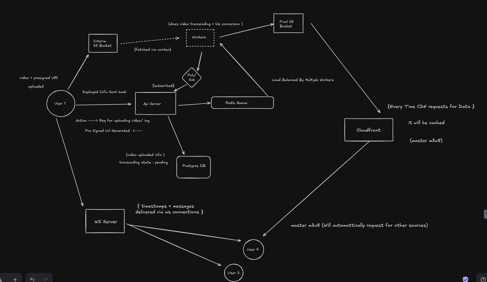

# Video Sync Platform

A real-time video synchronization platform that enables users to watch videos together in perfect sync. This platform allows users to create channels, upload videos, and experience synchronized playback with other users in real-time.

## Overview

Video Sync is a distributed system consisting of multiple services working together to provide a seamless video watching experience:

- **Frontend**: Next.js application providing the user interface
- **Backend**: Express.js API server handling core functionality
- **WebSocket Server**: Real-time communication service
- **Worker**: Video processing and transcoding service

## Architecture Overview



### System Flow

1. **Video Upload Flow**:

   - User requests a presigned URL from the API server
   - Video is uploaded directly to an interim S3 bucket
   - Upload info is stored in Postgres DB with 'pending' status
   - API server publishes transcoding job to Redis Queue

2. **Video Processing Flow**:

   - Workers fetch jobs from Redis Queue
   - Process video (transcoding + HLS conversion)
   - Store processed content in final S3 bucket
   - Notify API server via Redis Pub/Sub

3. **Video Delivery Flow**:

   - CloudFront CDN serves video content
   - Automatic quality switching (m3u8)
   - CDN caching for optimal performance

4. **Real-time Synchronization Flow**:
   - WebSocket server manages user connections
   - Timestamps and messages delivered via WS
   - Load balanced across multiple workers
   - Redis Pub/Sub for cross-worker communication

## Key Features

### Real-time Video Synchronization

- Perfectly synchronized video playback across multiple users
- Real-time play/pause/seek synchronization
- Low-latency communication
- Automatic latency compensation
- Custom HLS (HTTP Live Streaming) implementation
- Adaptive bitrate streaming support (m3u8 master playlist)
- CDN-backed video delivery for optimal performance

### Channel Management

- Create and join video watching channels
- Real-time user presence
- Channel-based permissions
- Private and public channel support
- Channel-specific chat rooms
- User role management (admin, moderator, viewer)

### Video Management

- Upload and store videos using presigned URLs
- Two-stage S3 storage (interim → final)
- Custom FFmpeg transcoding pipeline
- Multiple quality presets (1080p, 720p, 480p, 360p)
- Secure video storage with AWS S3
- CloudFront CDN integration for global delivery
- Automatic thumbnail generation
- Video metadata extraction

### User Experience

- Modern, responsive interface
- Real-time chat with message history
- User presence indicators
- Dark/Light mode support
- Typing indicators

## Architecture

The platform is built using a microservices architecture:

```
Video Sync Platform
├── frontend/           # Next.js frontend application
├── backend/           # Express.js API server
├── ws-server/         # WebSocket server for real-time sync
└── worker/            # Video processing service
```

### Service Communication

- Frontend ↔ Backend: REST API
- Frontend ↔ WebSocket Server: WebSocket (for video sync and chat)
- Backend ↔ Worker: Redis Queue
- All Services ↔ Redis: Caching and Pub/Sub
- Video Delivery: CloudFront CDN ↔ S3

### Storage Architecture

1. **Interim S3 Bucket**:

   - Temporary storage for uploaded videos
   - Direct upload via presigned URLs
   - Cleaned up after processing

2. **Final S3 Bucket**:

   - Stores processed videos and HLS segments
   - Connected to CloudFront CDN
   - Organized by video ID and quality levels

3. **CloudFront CDN**:
   - Global content delivery
   - Automatic caching
   - HLS manifest and segment serving

### Video Processing Pipeline

1. **Upload**:

   - Generate presigned URL for direct S3 upload
   - Store upload metadata in PostgreSQL
   - Trigger processing via Redis Queue

2. **Transcoding**:

   - Worker service processes videos using custom FFmpeg pipeline:
     - Video quality variants (1080p, 720p, 480p, 360p)
     - HLS segment generation
     - Audio stream optimization
     - Thumbnail generation
   - Load balanced across multiple workers

3. **Storage**:

   - Processed videos stored in final S3 bucket
   - HLS manifests and segments organized by video ID

4. **Delivery**:
   - Videos served via CloudFront CDN
   - Automatic quality switching via master m3u8
   - Global edge caching

### Real-time Communication

- **WebSocket Server**:

  - Handles multiple real-time features:
    - Video playback synchronization
    - Chat messages and reactions
    - User presence updates
    - Channel events
  - Load balanced across multiple instances
  - Timestamps + messages delivered via WS connections

- **Redis Pub/Sub**:

  - Cross-service communication
  - Worker coordination
  - Real-time event broadcasting

- **Message Queue**:
  - Video processing job distribution
  - Background task management
  - Load balancing across workers

## Technology Stack

### Frontend

- Next.js 14 (App Router)
- TypeScript
- Tailwind CSS
- Radix UI
- Zustand
- Plyr
- Custom HLS player implementation

### Backend

- Node.js
- Express.js
- TypeScript
- Prisma ORM
- PostgreSQL
- Redis
- AWS S3
- CDN Integration

### WebSocket Server

- Node.js
- ws
- Redis
- TypeScript
- Custom protocol for real-time sync

### Worker

- Node.js
- FFmpeg
- AWS S3
- Redis
- TypeScript
- Custom transcoding pipeline

## Getting Started

### Prerequisites

- Node.js 18.17 or later
- pnpm package manager
- PostgreSQL database
- Redis server
- FFmpeg
- AWS S3 bucket and credentials
- CDN configuration

### Installation

1. Clone the repository:

   ```bash
   git clone https://github.com/yourusername/video-sync.git
   cd video-sync
   ```

2. Install dependencies for all services:

   ```bash
   pnpm install
   ```

3. Set up environment variables for each service:

   - Create `.env` files in each service directory
   - Refer to individual service READMEs for required variables

4. Start the services in development mode:

   ```bash
   # Terminal 1 - Backend
   cd backend && pnpm dev

   # Terminal 2 - WebSocket Server
   cd ws-server && pnpm dev

   # Terminal 3 - Worker
   cd worker && pnpm dev

   # Terminal 4 - Frontend
   cd frontend && pnpm dev
   ```

## Development

Each service requires specific environment variables. Please refer to the individual service for detailed information about required environment variables.

## Project Structure

```
video-sync/
├── frontend/           # Next.js frontend application
│   ├── src/           # Source code
│   └── public/        # Static assets
├── backend/           # Express.js API server
│   ├── src/          # Source code
│   └── prisma/       # Database schema
├── ws-server/         # WebSocket server
│   └── src/          # Source code
└── worker/            # Video processing service
    └── src/          # Source code
```
